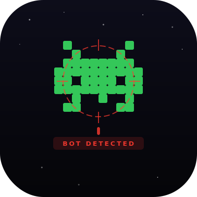

<div align="center">
  
  <h1>FlagR</h1>
  <p>Bot detection for the <a href="https://forms.gle/fpe9cFkgn1e6BYEG8">Bot or Not Competition</a></p>
</div>

---

Consumes a time-ordered corpus of tweets (`dataset.posts&users.json`) and outputs the user IDs it believes are bots.

## How It Works

```
dataset.posts&users.json
        │
        ▼
  Feature Extraction  ──►  69 per-user features across 10 groups
  (src/features.py)         profile, hashtag, text, links, temporal,
                             structural, cluster, network, semantic, volume
        │
        ▼
  Decision Pipeline   ──►  Hard bot rules → Whitelist → XGBoost/GradientBoosting
  (src/detector.py)         with ML floor guard on hard rules
        │
        ▼
  [team_name].detections.[lang].txt   (one user_id per line)
```

## Decision Pipeline

Scoring runs through four layers in order:

| Layer | Condition | Outcome |
|-------|-----------|---------|
| Hard bot rules | Extreme patterns + ML score ≥ 0.35 | Flag unconditionally |
| Whitelist | All 4 human signals present | Never flag |
| High-confidence ML | Score ≥ trained threshold (0.65/0.72) | Flag |
| Sub-threshold | Score < threshold | Not flagged |

## Feature Groups (69 features)

| Group | # | Key Signals |
|-------|---|-------------|
| Profile | 11 | Username digit ratio, entropy, description quality, location |
| Hashtag | 9 | Hashtag rate, diversity, sequence repeat, **trailing rate**, **count consistency** |
| Text | 16 | Lexical diversity, compression ratio, duplicate ratio, sentence length CV |
| Links | 7 | Link rate, mention rate, URL position, mention diversity, shared campaign targets |
| Temporal | 12 | Posting hour entropy, inter-post gap CV, burst score, **temporal coordination** |
| Structural | 6 | Near-duplicate ratio, template score, cross-account coordination |
| Cluster | 2 | Cluster size, cluster bot density |
| Network | 4 | Mention unique count, diversity, top account rate, shared mention targets |
| Semantic | 2 | Generic phrase rate, quote tweet ratio |
| Volume | 4 | Tweet count, z-score, near-cap flag |

### New in this version
- `temporal_coordination_score` — fraction of posts within 60s of another account's post (catches coordinated networks without text overlap)
- `cluster_size` / `cluster_bot_density` — how many accounts share the same top hashtag and how suspicious that cluster is
- `hashtag_trailing_rate` — fraction of posts where hashtags only appear in the last 30% of text (LLM-bot pattern)
- `hashtag_count_consistency` — bots use the same number of hashtags every post; humans vary
- `shared_mention_targets_score` — fraction of mentions going to accounts targeted by 3+ users (campaign detection)
- `generic_phrase_rate` — generic bot phrases normalized by word count

## Scoring Objective

```
score = 2×TP − 2×FN − 6×FP
```

A false positive costs 3× more than a missed bot. Hard rules only fire when ML score ≥ 0.35 to prevent overriding confident human verdicts.

---

## Models

| Lang | Algorithm | Threshold | CV Score | Precision | Recall |
|------|-----------|-----------|----------|-----------|--------|
| EN | XGBoost (tuned) | 0.65 | 358 | 0.977 | 0.933 |
| FR | GradientBoosting (tuned) | 0.65 | 158 | 0.971 | 0.900 |

Both models selected via 5-fold StratifiedKFold CV optimizing `2×TP − 2×FN − 6×FP`, then tuned with GridSearchCV (F1 scoring).

Training data: 1220 EN users (datasets 1, 3, 5, 30) + 797 FR users (datasets 2, 4, 6, 31).

---

## Setup

```bash
cd bot-detector
pip install -r requirements.txt
brew install libomp  # macOS only, required for XGBoost
```

**Python 3.9+ required.**

---

## Usage

### Desktop App

```bash
cd bot-detector
python app.py
```

Load any competition dataset JSON. Optionally load a ground truth `.txt` file to see TP/FP/FN breakdown.

Also supports Indiana University / vendor-format datasets (raw Twitter API tweet lists).

### Command Line — Train

```bash
cd bot-detector
python train.py \
  --en-dataset data/merged_en.json \
  --en-bots    data/merged_bots_en.txt \
  --fr-dataset data/merged_fr.json \
  --fr-bots    data/merged_bots_fr.txt \
  --output-dir artifacts/
```

Pre-trained artifacts are committed in `artifacts/` — skip this for inference.

### Command Line — Run Detector

```bash
cd bot-detector
python run_detector.py \
  --input  /path/to/dataset.posts_users.json \
  --output teamname.detections.en.txt \
  --artifacts artifacts/
```

Output includes per-user scores, decision reason (hard rule / whitelisted / ML), and corroborating signals.

---

## Project Structure

```
bot-detector/
├── src/
│   ├── features.py     # Feature extraction (69 features per user)
│   ├── model.py        # Training, CV, GridSearchCV tuning, threshold calibration
│   ├── detector.py     # Inference pipeline with layered decision system
│   └── utils.py        # Scoring, I/O, dataset format adapter
├── data/               # Practice datasets (JSON + bot labels)
├── artifacts/          # Saved models, scalers, thresholds
├── outputs/            # Validation reports, confusion matrices, ablation
├── train.py            # Training entrypoint
├── run_detector.py     # Inference entrypoint
└── app.py              # FlagR desktop GUI
```
